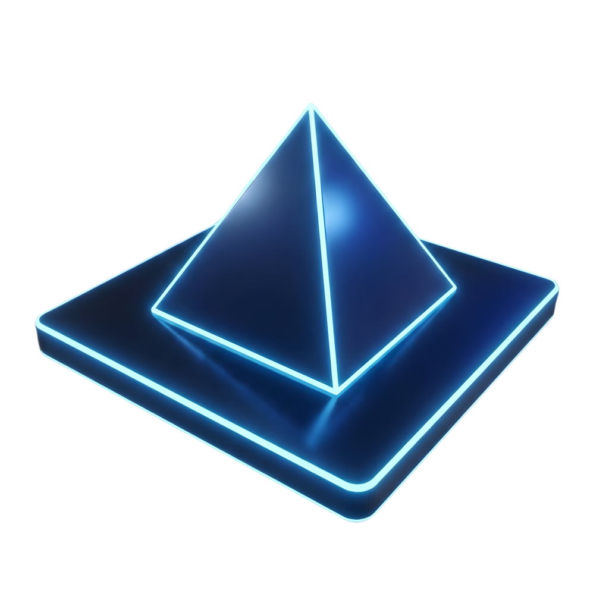
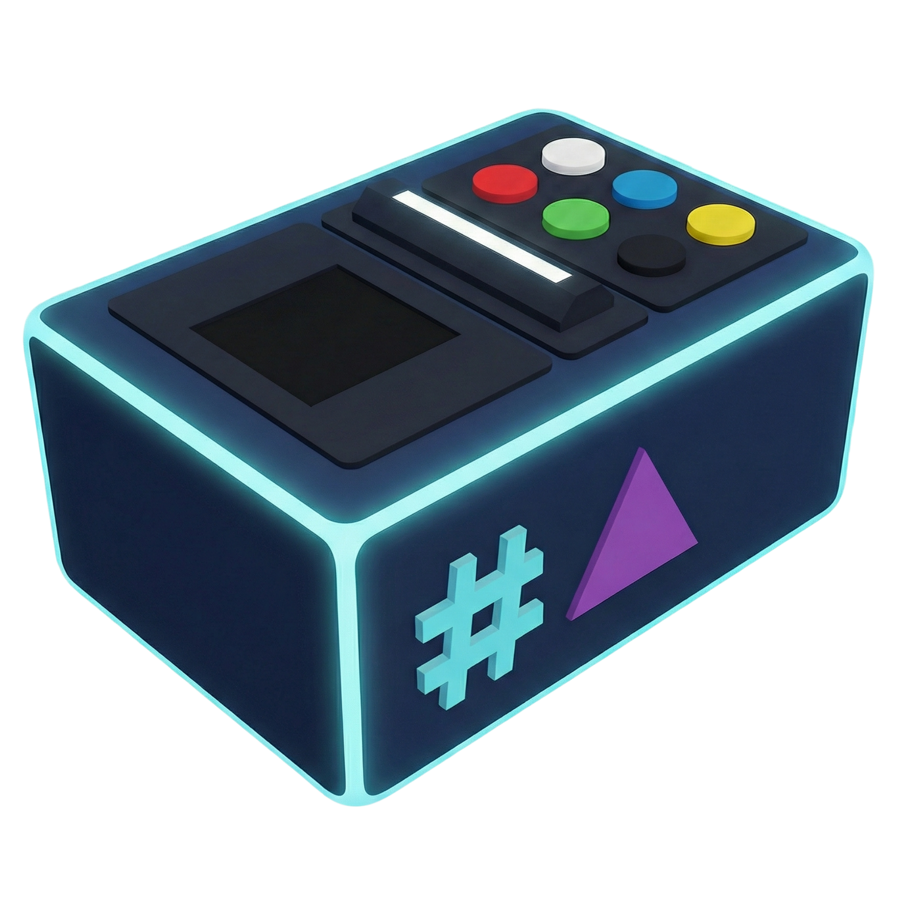

# Guía de marca diseño y estilo de La Piràmide

Referencia editorial vigente del proyecto. Última actualización: **9 octubre
2026**. Recoge las decisiones del equipo, la información publicada y la revisión
de recursos gráficos. Leer antes de editar, como establece [AGENTS.md](../AGENTS.md).

Esta guía sirve a diseño, frontend, marketing y Game Master. Mantiene una identidad
común sin congelar las mecánicas, rondas o textos que todavía están evolucionando.
Su alcance es editorial y visual: no es un registro de cambios, un informe de
pruebas ni un manual técnico. No incluir soluciones de puzzles, parámetros de
ejecución, contratos del backend o instrucciones particulares del test.

## Cómo interpretar las decisiones

- **Acordado:** dirección expresada por el usuario y decisiones aceptadas.
- **Implementado:** comportamiento comprobado en el proyecto, no necesariamente
  validado todavía con hardware o público real.
- **Piloto:** aplicación parcial que requiere validación antes de extenderse.
- **Criterio editorial:** norma de trabajo de esta guía; no implica que todos los
  recursos existentes ya la cumplan.
- **Pendiente:** trabajo por realizar. No describirlo como una prestación disponible.

El usuario puede cambiar estas decisiones. Registrar aquí el cambio y su alcance.
Los documentos `output/marca/La-Piramide-guia-de-marca-*.docx` y `.pdf` son versiones
históricas de consulta. No recuperar automáticamente sus recursos descartados.

## Producto y posicionamiento

La Piràmide es un juego cooperativo de gran formato: **10 a 20 jugadores, diez
terminales y una pantalla compartida**, con un Game Master que conduce la sesión.
Todo el grupo trabaja hacia una misión común. Puede haber tiempo, puntuación y
retos individuales; el resultado que protagoniza la experiencia es colectivo.

Cada persona o pareja utiliza un token intransferible. La información y las
acciones están repartidas: el grupo necesita comunicarse y coordinarse. La
comunicación comercial debe explicar esa aportación de cada participante.

Se monta en empresas o salas de eventos. La iluminación DMX puede acompañar el
montaje. Mostrar el equipamiento real y el juego compartido. Evitar hologramas,
decorados monumentales o salas futuristas que el servicio no proporciona.

La oferta publicada indica 60–80 minutos, contratación bajo petición y participación
sin experiencia previa. Puede estudiarse personalización con presupuesto aparte.
Estos datos comerciales se revisan antes de publicar; no determinan los tiempos
internos de cada puzzle. Mantener precios y condiciones en propuestas comerciales,
no en constantes de diseño. No prometer mejoras cuantificadas de productividad o
cohesión sin evidencia.

### Nombre e idiomas

- Castellano: **La Pirámide**.
- Catalán: **La Piràmide**.
- Inglés: **The Pyramid**.

Seguir los nombres de la web en piezas comerciales localizadas. Los recursos
actuales del juego usan principalmente la denominación catalana. Preparar variantes
del rótulo sin cambiar el símbolo ni mezclar idiomas dentro de una pantalla.

Fuentes: [página comercial](https://www.enigmik.com/escaperoom/la-piramide/),
[versión catalana](https://www.enigmik.com/ca/escaperoom/la-piramide/) y
[versión inglesa](https://www.enigmik.com/en/escaperoom/pyramid/).
Información consultada mediante contenido indexado el 5 octubre 2026; el lector
no pudo abrir directamente la página. Separar la oferta publicada del rediseño.

## Nombres editoriales de las pruebas

Acordado e implementado el 6 octubre 2026: recuperar los nombres históricos con
las sustituciones **Tras la Serpiente**, **QUIZ** y **Conexión Simultánea**.
El nombre editorial aparece en la intro, la cabecera del puzzle, las transiciones
y los controles del GM. Las versiones catalanas e inglesas conservan el significado.

| ID | Mecánica / alias técnico | Castellano | Catalán | Inglés |
| --- | --- | --- | --- | --- |
| 11 | Práctica / simulacro | Simulacro Inicial | Simulacre Inicial | Initial Simulation |
| 2 | Serpientes / laberinto | Tras la Serpiente | Rere la Serp | Follow the Snake |
| 1 | Sumas | Cálculo Extremo | Càlcul Extrem | Extreme Calculation |
| 8 | Memory | Memoria Extrema | Memòria Extrema | Ghost Memory |
| 3 | Trivial | QUIZ | QUIZ | QUIZ |
| 5 | Cronómetro | Pulso de Tiempo | Pols del Temps | Pulse of Time |
| 12 | Botones | Conexión Simultánea | Connexió Simultània | Simultaneous Connection |
| 4 | Música | Código Sonoro | Codi Sonor | Sound Code |
| 6 | Energía / final | Carga Final | Càrrega Final | Final Charge |
| 9 | Token a lloc, fuera del recorrido | Arquitectos del Orden | Arquitectes de l’Ordre | Architects of Order |
| 10 | Segmentos, fuera del recorrido | Patrón Maestro | Patró Mestre | Master Pattern |
| 7 | Segmentos difícil, fuera del recorrido | Segmentos avanzados | Segments avançats | Advanced Segments |

Decisión del 7 octubre 2026, implementada en castellano: Memory pasa a llamarse
**Memoria Extrema** en presentación, tablero, transiciones y controles del GM.
Su equivalente catalán, **Memòria Extrema**, se incorpora al traducir el conjunto
el 7 octubre 2026. El nombre inglés sigue pendiente de esa revisión.

La prueba 7 conserva su denominación descriptiva: no se ha acordado un nombre
creativo nuevo para ella. Las pruebas 7, 9 y 10 no se añaden al recorrido.

La explicación de Tras la Serpiente muestra una cabeza con el número del token
y cinco formas en orden. El equipo busca cada forma en los terminales y pasa el
token para completar la serpiente. Se mantiene la correspondencia de alarma.
Se sustituye la explicación antigua de entradas y centro de un laberinto.

## Personalidad y lenguaje

Cooperativa, enérgica, clara y apropiada para empresas. Debe parecer un juego
atractivo, no una herramienta administrativa. La tecnología apoya la acción.

- Hablar al equipo con verbos concretos: observad, buscad, coordinad, pulsad.
- Una instrucción principal por momento. El GM explica los detalles.
- Separar estado de acción: «Esperando al equipo» no significa «Pulsad para empezar».
- Evitar culpar al jugador. Explicar el estado y la acción posible.
- No añadir reintentos, penalizaciones o límites que la mecánica no contemple.
- Eliminar a Cero de la narrativa nueva.
- Comprobar castellano, catalán e inglés con el mismo significado y sin desbordes.

Referencias de tono, sujetas a las reglas de cada juego:

| Momento | Ejemplo |
| --- | --- |
| Campaña | El reto es de todos |
| Descriptor | Juego colaborativo para empresas |
| Dato de producto | 10–20 jugadores · 10 terminales · Un único equipo |
| Acción comercial | Solicitar propuesta |
| Memory | Observad las fichas y recordad su información |
| Logro | Reto superado. La pirámide sigue creciendo |
| Cierre | Lo habéis conseguido juntos |

## Identidad visual

Fondo oscuro grafito, texto blanco cálido y acentos cian y magenta. Titulares
contundentes y una pirámide de bloques reconocible. Marketing y pantallas comparten
la misma familia. La espectacularidad se concentra en momentos de apertura y logro;
durante el puzzle manda la lectura del tablero.

### Pirámide

Maestro: [`static/branding/piramide-vector.svg`](../static/branding/piramide-vector.svg).
Componente: [`static/js/pyramid-logo.js`](../static/js/pyramid-logo.js).

- Escalar proporcionalmente; no recortar cúspide ni deformar base.
- Reservar alrededor al menos la altura de un bloque como criterio de partida.
- Reducir brillo y detalle cuando sea pequeña. Validar el mínimo en cada soporte.
- Mantener estructura y bloques. Sus estados pueden representar progreso.
- No asociar cada ladrillo a una persona ni a un terminal sin una regla explícita.
- La pirámide se usa para identidad, progreso y celebración; no encerrar cada
  aviso o elemento de juego en otro triángulo.
- El logo PNG antiguo se retiró de `static/`; las pantallas utilizan el SVG maestro. Las maquetas históricas conservan su copia en `output/legacy-assets/`.
- `static/images/no_usadas/shared/branding/logo_adn.png` se reserva para firma del organizador
  donde corresponda. No sustituye al logo del juego. Para el cierre se ha
  incorporado el maestro actual `static/images/shared/branding/adn-games.svg`:
  versión horizontal a color de ADN Games, facilitada desde la carpeta de
  identidad de marca. Convive con La Pirámide en la foto final,
  sin recolorear ni deformar ninguno de los dos logos.
- Una variante monocroma definitiva para impresión sigue pendiente.

### Paleta

| Papel | HEX | Uso |
| --- | --- | --- |
| Grafito | `#0A1016` | Fondo principal |
| Blanco cálido | `#F3EEE4` | Texto y cifras |
| Cian | `#39D6E5` | Identidad y foco |
| Magenta | `#DC68A7` | Acento complementario |
| Ámbar | `#EDB970` | Atención temporal y culminación |
| Menta | `#71E7DB` | Confirmación o logro |
| Rojo | `#F15C68` | Error o alarma |
| Panel | `#14232C` | Agrupación funcional |
| Texto secundario | `#A8BBC5` | Apoyo no crítico |

La paleta de marca no sustituye los colores funcionales de fichas, botones y
señales. Acompañar estados con texto, forma o símbolo. Contornear las fichas negras
sobre fondos oscuros. Consolidar variaciones existentes en variables compartidas
al migrar cada pantalla; no recolorear el juego de forma indiscriminada.

### Identidad de la etapa QUIZ

Acordado e implementado el 6 octubre 2026: magenta `#DC68A7` como acento principal
de la presentación y el puzzle del QUIZ, sobre grafito `#0A1016` y paneles
`#14232C`. Preguntas y respuestas neutras en blanco cálido `#F3EEE4`; texto de
apoyo `#A8BBC5`. El magenta identifica la etapa en títulos, números neutros,
bordes y revelados; no expresa una respuesta ni un resultado.

Se conservan los colores funcionales existentes de botones verde/rojo,
respuestas sí/no, acierto/fallo, estados contestados y logros. Las imágenes del
terminal y sus botones no se recolorean. La variante está acotada al puzzle 3
en su presentación y tablero; el mapa general mantiene sus otras etapas.

Decisión del 9 octubre 2026, implementada: la entrada del QUIZ se diferencia
de las otras pruebas con cuatro paneles magenta y las letras **Q · U · I · Z**
que entran sucesivamente. «Canvi de ritme» / «Cambio de ritmo» / «A change of pace»
anuncia la etapa central; debajo, «Compartiu el que sabeu. Decidiu junts.» y sus
equivalentes castellano e inglés refuerzan el carácter cooperativo. Composición
horizontal con haces de luz, sin las bandas diagonales de las otras entradas.
Conserva los 4,2 segundos, el paso automático al mapa, los controles del GM y
la alternativa estable con movimiento reducido. Verificación en simulación a
1920 × 1080 y 1280 × 720, en los tres idiomas: `output/entrada-quiz/`.

Jerarquía del QUIZ: destacar la pregunta con mayor peso tipográfico, una barra
lateral magenta y un fondo magenta tenue. Decisión actualizada el 8 octubre
2026, implementada: la pregunta y cada respuesta ajustan su tamaño de forma
independiente según la longitud y los saltos de línea. Corrección tras la
revisión del usuario: limitar la ampliación para dejar aire en los paneles,
con pregunta de hasta 56 px y respuestas de hasta 48 px en el canvas 1080p.
Los textos largos siguen reduciéndose cuando lo necesitan.
Una respuesta corta puede tener mayor tamaño que una pregunta larga. Conservar
el texto completo, los números y los indicadores de elección. El ajuste se
mide dentro del tablero y el conjunto se escala a la ventana; no elegir tamaños
por resolución ni reducir todas las respuestas por la opción más larga.
Comprobado con las 435 preguntas activas y textos adicionales largos, en
ventanas 16:9, 4:3 y 4K con distinta densidad de píxeles: `output/quiz-texto/`.
Solo simulación; la lectura desde la sala sigue pendiente.

Decisión del 8 octubre 2026, implementada en el tablero: cada respuesta muestra
un tick y una X junto al texto. El botón verde resalta el tick verde; el rojo
resalta la X roja. El símbolo alternativo permanece neutro para hacer visible
que se puede cambiar la elección. La fila, el número y el texto conservan su
apariencia neutra durante la selección. Un recordatorio indica que se puede
cambiar con el otro botón hasta que todos los terminales hayan respondido,
en coherencia con Atención y las notas del GM. Los símbolos representan la
elección enviada; la comprobación final conserva su señal de acierto o fallo.
Decisión ampliada el 8 octubre 2026, implementada: símbolos mayores y elección
con fondo verde o rojo sólido, símbolo grafito y resplandor localizado; la
alternativa queda atenuada. Cada entrada o cambio produce un golpe de escala,
una onda alrededor del símbolo y un resplandor breve en el contorno de su fila.
El efecto termina y la selección permanece visible. Con movimiento reducido
se muestra directamente el estado estable. Recuperar el estado o mostrar el
resultado no repite el efecto de entrada.
Verificación aislada a 1920 × 1080 y 1280 × 720, en los tres idiomas:
`output/quiz-seleccion/`. Solo simulación, sin MQTT ni hardware.

Decisión del 9 octubre 2026, implementada: los números de terminal junto a cada
respuesta del QUIZ aumentan de 26 a **66 px**, en negrita, dentro de un bloque
de **84 × 84 px** en el canvas 1080p, igual que los indicadores de tick y X.
Conservan su correspondencia 0–9 y el magenta neutro durante la selección;
el resultado mantiene sus colores funcionales. El texto de cada respuesta sigue
ajustándose al espacio disponible. Verificado en simulación a 1920 × 1080 y
1280 × 720, con respuestas seleccionadas y resultados: `output/quiz-seleccion/`.

### Tipografía

- Titulares: `PiramideDisplay`, alias de **Noto Sans ExtraCondensed Black**.
- Archivo: `static/fonts/PiramideDisplay-Black.ttf`.
- Instrucciones, párrafos y controles: Arial o alternativa equivalente validada.
- Conservar `PiramideDisplay-LICENSE.txt` y su aviso SIL Open Font License 1.1.
- Orbitron se retiró de las pantallas y de `static/fonts/`. Los controles y datos usan Arial; los titulares comunes usan PiramideDisplay.
- Reservar mayúsculas y tipografía condensada para textos breves.
- Temporizadores con cifras de anchura estable.

## Pantalla compartida y composición

Referencia **1920 × 1080, 16:9**, comprobada también a **1280 × 720**. Diseñar para
10–20 personas a distancia, no solo para alguien sentado delante del ordenador.

1. Elemento que hay que observar o manipular.
2. Acción vigente.
3. Estado secundario.

Ejemplos actuales a 1080p: título de presentación 96 px; objetivo 35 px;
instrucción de Memory y nombre compacto 33 px; metadatos 17–23 px. Son referencias,
no mínimos de legibilidad garantizados. Ninguna pista crítica debe relegarse a
texto diminuto. Validar desde la última fila con la iluminación real.

Bordes discretos, radios pequeños y agrupación por proximidad. Las diagonales y
bloques tienen más protagonismo en marketing y presentaciones. Evitar marcos
ornamentales, paneles redundantes y animaciones continuas sobre el tablero.

## Recorrido y presentaciones

1. **Bienvenida en espera:** imagen estable hasta orden del GM, con el grupo colocado.
2. **Apertura:** secuencia automática seguida, transiciones suaves, sensación de
   vídeo. El GM no explica durante esta secuencia.
3. **Práctica:** familiarización, sin sumar un reto a la pirámide.
4. **Presentación del puzzle:** entrada automática del nombre y composición
   persistente con tres revelados del GM.
5. **Cuenta atrás e inicio:** orden explícita cuando se ha entendido el reto.
6. **Juego:** máxima superficie útil y estado funcional visible.
7. **Logro:** actualizar la pirámide por un reto realmente conseguido; el GM prepara
   el siguiente. Navegar o previsualizar no otorga progreso.
8. **Final y foto:** celebración y composición estable para el grupo.

Decisión del 9 octubre 2026, implementada: cada presentación de prueba incluye
una pantalla de título de **4,2 segundos**, con el nombre editorial grande,
bandas diagonales de luz y una entrada suave de escala y enfoque. Conserva el
acento de la etapa; el QUIZ utiliza su entrada propia de letras sobre paneles
magenta, descrita en su identidad. La música ambiental continúa.
Al terminar, pasa automáticamente a la primera explicación; objetivo, herramientas,
acción y atención siguen avanzando a petición del GM. El Simulacro muestra primero la entrada «Cómo funciona el juego» y la explicación
manual del funcionamiento del juego,
después su título y a continuación objetivo, herramientas y acción. El QUIZ
conserva su mapa del recorrido después del título.
El juego nunca comienza por el paso del tiempo de esta entrada.

El GM puede pausar, reanudar, saltar o repetir la entrada. Repetir la presentación
vuelve a su primer paso: entrada al funcionamiento general en el Simulacro y título en
las demás pruebas. Con movimiento reducido se mantiene el título
estable durante el mismo intervalo. Verificado con las nueve pruebas y los tres
idiomas a 1920 × 1080 y 1280 × 720 mediante simulación aislada, sin MQTT ni
hardware: `output/entrades-proves/`.

Decisión del 7 octubre 2026, implementada: la pantalla de logro con la pirámide
y el progreso no anuncia la siguiente prueba. El GM conserva la información
del siguiente paso y abre su presentación cuando corresponda.

Decisión del 7 octubre 2026, implementada: eliminar la pantalla «¡YA!» de
todas las presentaciones de puzzles, también «JA!» y «GO!» en sus idiomas.
La cuenta atrás muestra 3 → 2 → 1 y entra directamente al juego. Pulso de
Tiempo conserva la entrada directa a su preparación, sin cuenta atrás de
presentación adicional.

Recorrido actual de referencia: Simulacro Inicial 11 → Tras la Serpiente 2 →
Cálculo Extremo 1 → Memoria Extrema 8 → QUIZ 3 → Pulso de Tiempo 5 →
Conexión Simultánea 12 → Código Sonoro 4 → Carga Final 6 → cierre.
Ocho retos puntuables; Segmentos 10 queda fuera del recorrido activo. Consultar
el recorrido vigente antes de cambiar su representación.

Acordado: el QUIZ constituye una etapa central entre dos bloques de retos,
con tres pruebas por bloque como configuración inicial, sin exigir esa cantidad.
El Trivial sigue contando como reto puntuable.
Diagrama común en la apertura automática y como primer paso manual
de la presentación del QUIZ. Muestra práctica → primer bloque → QUIZ →
segundo bloque → final, con cantidades y casillas del recorrido vigente.
«Estáis aquí» identifica la etapa. Decisión actualizada el 6 octubre 2026: en la
intro del QUIZ el mapa presenta las pruebas del primer bloque como superadas
y las del segundo bloque pendientes, también al abrir directamente la intro.
Es un esquema explicativo de esa etapa; no modifica los logros registrados,
la puntuación ni el progreso real de la pirámide. La apertura muestra todos los
retos pendientes. La nueva apertura revela el mapa en varios momentos del guion
y permite pausar o repetir.

Explicación del GM al llegar al Trivial: «Ahora llega el QUIZ: compartid lo que
sabéis y decidid juntos. Después vendrá el segundo bloque de retos y el final».
Esta nota aparece en el control de presentación. A continuación siguen los tres
revelados habituales: objetivo, terminales y tokens, interacción. La cuenta atrás
solo se habilita después de Atención, incorporada el 7 octubre 2026,
también con el paso previo de recorrido.

Verificado el 6 octubre 2026: Chrome con fixtures aislados, tres idiomas a
1920 × 1080 y 1280 × 720; bloques vacíos/desiguales, progreso parcial y retorno
desde las reglas al mapa. Solo simulación; legibilidad desde la sala y ritmo con
público pendientes. Capturas y comprobaciones: `output/recorrido/`.

### Apertura narrativa: Despertar la Pirámide

Decisión actualizada e implementada el 6 octubre 2026: la narración aprobada lleva
la historia y la pantalla sirve de apoyo visual. Se sustituye la apertura de seis
pantallas con párrafos. Se retiran la insistencia en «conectar» y las instrucciones
«caminad sin correr, dejad paso». **Los tokens se reparten al terminar la intro,
antes de explicar el Simulacro Inicial**, uno por persona o pareja.

La energía de la Pirámide está repartida entre diez terminales. Recuperarla exige
poner en común las aportaciones: una pista encontrada por alguien cobra sentido
gracias a otra persona. Escuchar, hacer sitio a otras ideas y repartirse las tareas
forman parte de la historia. No se prometen resultados empresariales medibles.

Implementado: 16 momentos visuales y una pantalla final de espera. La Pirámide
aparece en silencio; se descubre la energía en los terminales. Las escenas sobre
compartir y escuchar utilizan luz sobre la Pirámide maestra: encendido de las totxanas de la base hacia la cúspide, con el mismo
relleno que el progreso del juego. Aparecen los
titulares «Cada mirada cuenta» y «Todas las voces cuentan», sincronizados con la voz. Siguen habilidades, búsqueda y herramientas. El mapa
revela práctica y primer bloque, QUIZ magenta, segundo bloque y Carga Final; después
vuelve a señalar el inicio. Aparecen el token y el pulso final de la Pirámide.

- Solo titulares breves donde ayudan. Sin párrafos, consignas repetidas, firma
  permanente ni contador de escena en la pantalla de jugadores.
- Se reservan **y=880–1080 del canvas 1920 × 1080** para subtítulos de un máximo
  de dos líneas. El guion aparece por frases temporizadas en castellano, catalán
  e inglés, a 40 px y con márgenes laterales amplios. Ningún gráfico invade la banda.
  El fondo grafito y su iluminación son continuos hasta el borde inferior, sin
  una franja oscura propia para los subtítulos.
  Los subtítulos se detienen con la pausa, se reinician al navegar y desaparecen
  durante el reparto de tokens. Las instrucciones del GM no se subtitulan.
- Retirados los diagramas de pistas y las ilustraciones de personas, rechazados
  por falta de claridad y de coherencia visual, respectivamente.
  Los objetos reales usan el catálogo autorizado; botones y símbolos se conservan.
- La pirámide se llena despacio en cinco etapas acumulativas: Las pistas (20 %),
  Cada mirada cuenta (40 %), El primer pulso (60 %), Hacer sitio (80 %) y llamada
  final (100 %). Cada etapa conserva los bloques anteriores y enciende los nuevos
  uno a uno desde la base. Solo se completa en la llamada final. No registra
  logros; el mapa sigue pendiente.
- El mapa deriva de `PUZZLE_ORDER`; admite bloques vacíos/desiguales. Si no hay
  QUIZ en la configuración se omite su momento de la apertura y del mapa.
- Al final, **la apertura se detiene en el reparto de tokens**. El GM avanza con
  «Tokens repartidos · explicar el funcionamiento». La práctica y su cuenta atrás
  mantienen el control manual.
- Pausa, anterior/siguiente y repetición siguen disponibles. El idioma se elige
  en Sesiones. La pausa
  congela las animaciones y música; movimiento reducido presenta composiciones
  estables. En habilidades muestra las cuatro juntas.

Decisión del 9 octubre 2026, implementada: la espera de reparto al terminar
la apertura muestra **solo el token centrado con un indicador circular de carga**
cian, suave y continuo. Se retiran el título del Simulacro Inicial y la pirámide
adicional en los tres idiomas. No hay texto, subtítulos ni partículas en esta
pantalla. El indicador expresa una espera indeterminada, no progreso real:
el GM sigue avanzando manualmente cuando todos tienen su token. Con movimiento
reducido se mantiene la composición estática.
Verificado en simulación aislada a 1920 × 1080 y 1280 × 720, en los tres
idiomas, incluido movimiento reducido y avance manual del GM. Capturas en
`output/repartiment-tokens/`.

Corrección de sincronización implementada el 9 octubre 2026: en catalán,
las habilidades y los resaltados de botones, luces y símbolos siguen las palabras
de la locución. Se conservan los mismos gráficos, colores y distribución; pausa
y navegación mantienen esa correspondencia. Ajustados también los tiempos de
los dos subtítulos de la llamada final, sin cambiar el texto ni el MP3.

**Implementado en catalán:** locución aportada por el equipo, conservada sin cambios
como `static/audios/intro/intro-ca.mp3`. Dura 115,5 segundos y gobierna los cues,
las animaciones y el avance de escenas. Pausa, navegación y repetición actúan
sobre la voz y la pantalla juntas. La música baja durante la locución. En producción, la pista persistente
recupera el volumen bajo al llegar al reparto de tokens; la voz ya ha terminado. Tras el final natural de la voz, la Pirámide
permanece 2,6 segundos mientras la música se desvanece; el MP3 no se modifica ni
se corta la última frase. Pausar también congela este cierre. Si el navegador bloquea el audio, la intro
se pausa y ofrece «Activar so», con aviso al GM. Sin QUIZ se salta también su voz.

**Pendiente:** voces de apertura en castellano e inglés. Esos idiomas
mantienen los 169 segundos provisionales para ensayar. El guion completo sigue
disponible en las notas del GM, momento por momento.

Fuente del guion: `static/js/presentation-story.js`. Tiempos reales y cues catalanes:
`static/js/presentation-recordings.js`; exportación `static/audios/intro/intro-ca.vtt`.
Visuales: `static/js/presentation-opening.js` y `static/css/presentation-opening.css`.
La banda conserva dos líneas como máximo y queda vacía en las pausas y el reparto.
Corrección de dirección visual: el usuario ha rechazado los trazados de pistas y
las ilustraciones de personas. Ambos se retiran de las tres escenas de cooperación.
Dirección actualizada e implementada: iluminar cada totxana con el mismo relleno
que el progreso del juego, conservando su forma. El encendido se reparte en cinco
etapas de 20 %: Las pistas, Cada mirada cuenta, El primer pulso, Hacer sitio y
llamada final. Cada etapa empieza donde terminó la anterior y añade bloques
suavemente durante hasta cinco segundos, ajustados a los cues de la voz. No se
reinicia ni se llena toda al principio; tampoco vuelve a una totxana aislada.
Es una animación local: no registra logros ni cambia el progreso real.
Los titulares «Cada mirada cuenta» y «Todas las voces cuentan» siguen sincronizados
con escuchar y hacer sitio a otras ideas. En esta última escena, la pirámide se
atenúa para dar protagonismo al titular. Pausa y navegación siguen el reloj de
la narración. Movimiento reducido muestra el resultado estático de cada etapa,
no una pirámide completa desde el principio. Verificación aislada a dos
resoluciones y tres idiomas en `output/intro-cinc-passos/`; sin hardware.
En herramientas, token y terminal ocupan cajas de 720 × 720 px: el tamaño se
equilibra por la silueta visible, conservando sus proporciones y los recursos
autorizados. No expresa la escala física de los objetos.
Las ilustraciones descartadas quedan archivadas en `output/intro-personas/descartadas/`,
sin referencias en el juego.
Guion de producción: [APERTURA_NARRATIVA.md](APERTURA_NARRATIVA.md).
La versión catalana está revisada para locución y recogida íntegramente en ese
documento. «Català» en Sesiones selecciona títulos, recorrido, subtítulos y notas
de la apertura; la indicación de reparto pasa a «Tokens repartits · explicar el
funcionament». Se conserva «token» como nombre del objeto usado durante el juego.

Verificado en Chrome con fixtures aislados: 17 estados × tres idiomas × dos
resoluciones (1920 × 1080 y 1280 × 720), todos los cues de subtítulos, bloques
vacíos/desiguales, recorrido sin QUIZ y movimiento reducido. Sin desbordes ni
imágenes ausentes. Pausa/reanudación de animación y música, navegación, idioma,
mapa progresivo y espera final comprobados en tiempo real; secuencia automática
completa comprobada acelerando solo los tiempos del fixture. El GM debe avanzar
para llegar a la práctica; no se inician juegos ni se otorgan logros desde la intro.
Tests de rutas, flujo y controles correctos. **Solo simulación, sin MQTT ni
hardware**. La locución catalana se ha comprobado con su reloj real: controles,
final natural, recorrido sin QUIZ y recuperación de sonido bloqueado. Revisión
de 17 escenas a dos resoluciones en `output/intro-ca-audio/`. Pendiente ensayo
con altavoces en la sala. Resultados y capturas del montaje anterior:
`output/apertura-narrativa/`; `output/apertura/` documenta la versión sustituida.

### Desenlace: Este momento es vuestro

**Acordado el 8 octubre 2026:** el cierre reconoce la experiencia compartida y
la aportación del equipo. No repasa la apertura ni enumera las pruebas. Se
aprueba el guion que empieza «¡Lo habéis conseguido! Respirad un momento» y
termina «La misión está cumplida. Este momento es vuestro». Se elimina la
frase «Ahora mirad a quienes tenéis al lado»; no debe recuperarse.

**Revisión acordada el 8 octubre 2026:** el primer montaje se considera poco
variado. El desenlace debe empezar mostrando cómo se completan los últimos
bloques, con un clímax de luz y sonido, antes del texto. La última pantalla
incorpora el logo ADN Games. El usuario facilita posteriormente los maestros
actuales en `ADN Games/01 - Identitat de marca/01 - Logotip actual/`.
**Actualizado:** se utiliza `Fitxers mestres/logoadndef-color.svg`, horizontal
con hélice, ADN en degradado y GAMES magenta, sin modificar su diseño.
Archivo activo: `static/images/shared/branding/adn-games.svg`.
El PNG anterior se retira a la reserva; el SVG conserva su aspecto y proporciones.

**Implementado en castellano y catalán:** Carga Final abre una única secuencia de cierre.
Los primeros diez segundos muestran el progreso anterior, encienden los bloques
recién conseguidos y culminan en una descarga de luz, partículas e impacto sonoro.
En el recorrido completo, se ve el paso de siete a ocho retos y la Pirámide al
100 %. Si faltan retos, se conserva el progreso real. No se reproduce antes la
celebración común ni se vuelven a sumar logros al repetir el cierre.

**Refuerzo acordado e implementado el 8 octubre 2026:** al encenderse el último
bloque, una onda recorre la Pirámide desde la base hasta la cúspide. Toda la
superficie queda más luminosa, con el contorno reforzado y luz en la cima; ese
estado se conserva durante el mensaje y la foto. La transformación distingue
el final de las celebraciones intermedias y solo aparece con todos los retos
completados. Movimiento reducido muestra directamente el estado estable.

Después entra el guion aprobado. La puesta en escena alterna la Pirámide,
fragmentos luminosos que se reúnen, una expansión en «¡Lo tenemos!» y cintas de
luz que primero recorren caminos distintos y después avanzan juntas. La foto
final queda estable con «ESTE MOMENTO ES VUESTRO», La Pirámide y ADN Games.
La iluminación es un efecto de pantalla; esta implementación no controla DMX.

El guion completo conserva subtítulos de hasta dos líneas en la banda
y=880–1080 del canvas 1920 × 1080. El efecto de carga acompaña el inicio del
cierre y el mensaje empieza después de su culminación.
El GM puede pausar, reanudar, repetir o pasar a la foto. Movimiento reducido
conserva composiciones y subtítulos, sin destellos ni desplazamientos.

**Decisión del 9 octubre 2026, implementada en el cierre catalán y castellano:**
sustituir la música habitual por una instrumental orquestal épica de victoria,
para distinguir el desenlace del resto de la partida. Se selecciona
**A Legend Will Rise**, de CodeManu, publicada con licencia CC0 en
[OpenGameArt](https://opengameart.org/content/a-legend-will-rise-orchestral).
Archivo local: `static/audios/musica_ambient/final-victoria.mp3`; créditos y origen
en `docs/audio/final-victoria-creditos.txt`. Se distribuye por USB con los audios.
La pista comienza con el cierre, baja bajo la voz catalana y gana presencia
en la foto. Pausar conserva su posición; repetir el montaje vuelve al inicio.
El fondo habitual permanece detenido durante el desenlace, incluidos los clics
y cambios a pantalla completa, y se recupera al salir. Verificado en Chrome
con simulación aislada, voz catalana y foto a 1920 × 1080 y 1280 × 720:
`output/final-victoria/`. Sin MQTT ni hardware; pendiente escucha en sala.

**Acordado e implementado el 9 octubre 2026 en catalán:** el audio aportado
`final_CAT.mp3` se conserva intacto como `static/audios/intro/final-ca.mp3`.
Tras los diez segundos de carga se reproducen 50,4 segundos de voz con el guion
aprobado: «Ho heu aconseguit!» hasta «Aquest moment és vostre». Los titulares y
subtítulos siguen esa versión y la foto conserva «AQUEST MOMENT ÉS VOSTRE»,
La Piràmide y ADN Games. La voz gobierna el avance durante la narración; la foto
entra al terminar el MP3, sin cortar la última frase. Pausar detiene voz, imagen
y música; repetir reinicia el montaje sin sumar progreso. La música se mantiene
baja bajo la voz. Si se bloquea el audio, el montaje espera y ofrece «Activar so».
Guion: `docs/audio/cierre-final-ca.txt`. Subtítulos exportados: `static/audios/intro/final-ca.vtt`.
El MP3 y el VTT se distribuyen por USB con la carpeta de audios.

**Pendiente:** locuciones castellana e inglesa y traducción del nuevo desenlace
al inglés. El montaje castellano utiliza 78 segundos
provisionales (10 de carga y 68 de mensaje), sin solicitar una voz inexistente.
El inglés conserva su cierre anterior. Texto de grabación castellano:
`docs/audio/cierre-final-es.txt`. Efecto final:
`static/audios/effects/final-charge.wav`, distribuido por USB con los audios.
Previsualización aislada: `static/previews/cierre-final.html`.

**Verificación:** cierre y foto revisados a 1920 × 1080 y 1280 × 720 mediante
simulación aislada, sin MQTT ni hardware. Comprobados el progreso real, los
subtítulos, el logo y la reproducción, pausa y repetición del efecto sonoro.
Evidencias: `output/cierre-final/`. Pendiente escuchar el montaje en la sala.

Versión catalana verificada a ambas resoluciones con simulación aislada:
subtítulos, pausa de carga y voz, repetición, recuperación de audio bloqueado,
final natural de la locución y foto estable. Evidencias: `output/cierre-catala/`.
Sin MQTT ni hardware; pendiente escucharla con los altavoces de la sala.

### Edición de las explicaciones de puzzles

Acordado: revisar primero las presentaciones en castellano. El usuario confirma
el conjunto el 7 octubre 2026 y autoriza la versión catalana completa, manteniendo
el diseño y las reglas aprobadas.
Decisión del 9 octubre 2026, implementada: **La misión está en vuestras manos**
se muestra al terminar el reparto de tokens y **antes del título Simulacro Inicial**.
Es una explicación manual del funcionamiento general del juego. Tres bloques
muestran la pantalla compartida (juegos, pistas e instrucciones), el token
personal que se conserva durante la partida y el terminal completo con sus
cuatro elementos identificados: lector del token, botones, luces y símbolos.
El recordatorio inferior explica acercar el token al lector para interactuar.
La cabecera dice «Funcionamiento del juego», sin anunciar aún el Simulacro.

Decisión del 9 octubre 2026, implementada: esta explicación tiene una entrada
propia de 4,2 segundos, **«COM FUNCIONA EL JOC»** en catalán, **«CÓMO FUNCIONA
EL JUEGO»** en castellano y **«HOW THE GAME WORKS»** en inglés. El rótulo breve
«Antes de empezar» sitúa el momento. Usa la misma composición de títulos del
juego y pasa automáticamente al diagrama, que espera la orden del GM.
Permite pausa, repetición y avance manual; movimiento reducido conserva el
rótulo estable. A continuación siguen el título y la explicación del Simulacro.
Verificación en simulación a 1920 × 1080 y 1280 × 720, en los tres idiomas,
con pausa, avance, retorno y movimiento reducido: `output/intro-funcionament/`.

El GM explica los tres bloques, señala los componentes de un terminal físico
y recuerda que su uso cambia según el reto. Las notas destacan compartir
información y coordinarse como un único equipo. Al avanzar aparece el título
Simulacro Inicial; después vienen su objetivo, herramientas y acción, y la
práctica se inicia cuando el GM lo ordena. La explicación general permanece
hasta que el GM avanza y no otorga progreso. Textos equivalentes en catalán,
castellano e inglés, incluidas las notas del GM. Verificado en simulación aislada
a 1920 × 1080 y 1280 × 720: orden, espera manual, avance al título y retorno
del GM, sin imágenes ausentes ni desbordes. Capturas en
`output/funcionament-joc/`; pendiente lectura desde la sala.

Decisión actualizada e implementada: retirar de todas las pantallas de
presentación las frases inferiores de apoyo («Repartid quién observa…»,
«Estas son vuestras herramientas», etc.) y su línea de separación. Incluye la
pantalla de elementos del Simulacro y los tres revelados de todos los puzzles.
El pie no ocupa espacio. Las ayudas de coordinación permanecen en el control
del GM; las instrucciones propias del esquema y la cuenta atrás se conservan.
Verificación aislada a 1920 × 1080 y 1280 × 720, sin hardware:
`output/presentaciones-sin-pie/`.

Simulacro Inicial, texto en castellano aprobado e implementado:

- **Objetivo:** Familiarizarse con el sistema siguiendo las instrucciones de la pantalla.
- **Herramientas:** Tokens y terminales.
- **Acción:** Mirad la pantalla → realizad la acción indicada → esperad la siguiente instrucción.

Conserva la pantalla previa «La misión está en vuestras manos». No tiene apartado
«Atención» ni añade reglas bajo la acción. La secuencia visual y las notas del GM
utilizan esos textos. Catalán e inglés conservan su contenido anterior hasta la
traducción del conjunto aprobado. Verificación aislada a ambas resoluciones:
`output/simulacro-aprobado/`, sin hardware.

Decisión implementada en las presentaciones en castellano: el apartado visual
se titula **Herramientas**, también en los controles del GM. La lista editorial
selecciona las imágenes; no se reproduce como rótulo debajo de ellas. En el
Simulacro aparecen el token y el terminal completo, sin «Tokens y terminales»
bajo los iconos. Para las próximas revisiones, mostrar el terminal completo
cuando se use en conjunto; destacar sus botones o su lector NFC cuando sean
la herramienta concreta, y añadir el token cuando se utilice. Las instrucciones
se explican en Acción. Las pistas funcionales de los otros puzzles se mantienen
hasta revisar cada presentación. No se anticipan sus herramientas ni traducciones.

Criterio acordado para las siguientes revisiones: cuando un puzzle incluya
«Atención», será un paso obligatorio antes del inicio. Su contenido y la ventana
superpuesta se implementarán al aprobar la presentación correspondiente; no
se añade a puzzles que no tengan ese apartado.

Composición aprobada e implementada para el Simulacro en castellano: cabecera
con título y logo en la misma fila, sin repetir «Descubrir · Simulacro Inicial».
El indicador de revelados queda debajo del logo. Objetivo y herramientas ocupan
áreas de 350 px de alto, con el conjunto centrado verticalmente; dos áreas superiores alineadas y franja de Acción de 210 px en el
canvas 1080p. El objetivo usa Arial negrita en blanco cálido dentro de un panel
sencillo, sin decoración de navegador. Herramientas muestra token y terminal
ampliados, sin flecha. Acción contiene tres textos y flechas, sin círculos
abstractos. Las posiciones se mantienen durante los revelados. Esta composición
se adaptará a los demás puzzles al revisar sus presentaciones.

Tras la Serpiente, revisión en castellano implementada con el formato del Simulacro:

- Objetivo: «Completar la serpiente correspondiente a cada token».
- Herramientas: token, terminal y símbolo como tres elementos independientes,
  alineados a la misma altura y sin rótulos inferiores. El símbolo no se
  superpone al terminal.
- Acción: «Identificad vuestra serpiente → buscad los símbolos en el orden indicado
  → pasad el token por cada terminal». La secuencia permanece visible en el juego;
  no se pide memorizarla.
- Atención: «Cuando suene la alarma, las serpientes se pondrán rojas. Los símbolos
  de la pantalla no cambian: buscad en los terminales el mismo símbolo con los
  colores invertidos».

Atención es el cuarto paso obligatorio, en una ventana superpuesta sin cierre
opcional. El GM puede retroceder y volver a mostrarlo; el inicio solo se habilita
al llegar a ese paso. Ejemplo con los recursos reales `symbol_4.png` y
`symbol_5.png`, versiones de colores invertidos, sin recolorear las imágenes.
El ejemplo distingue «Símbolo en pantalla» de «Símbolo que debéis buscar».
Durante la alarma, el tablero conserva los iconos originales y solo cambia la
señal visual de las serpientes a rojo; la inversión debe resolverla el equipo.
La correspondencia que valida el backend se conserva sin cambios.
Las notas del GM acompañan cada paso. El contenido nuevo y Atención están
traducidos al catalán; el inglés sigue usando el borrador castellano.
Verificación aislada a 1920 × 1080 y 1280 × 720: `output/serpiente-presentacion/`.

QUIZ, revisión en castellano implementada con el formato del Simulacro el
7 octubre 2026:

- **Objetivo:** «Identificar las 4 respuestas correctas».
- **Herramientas:** botones de los terminales. Mostrar el panel frontal completo
  `static/images/shared/terminal_3d/buttons_panel_front.png`, sin token ni rótulo
  inferior y conservando sus seis colores originales.
- **Acción:** «Leed la pregunta → identificad las respuestas correctas → marcad
  cada respuesta en su terminal».
- **Atención:** «Las respuestas de cada terminal se pueden cambiar hasta que se
  haya introducido una respuesta en todos los terminales».

Se conserva el mapa previo del recorrido y el acento magenta de la etapa.
Atención es el cuarto revelado del esquema, en una ventana superpuesta sin
cierre opcional ni ejemplo de símbolos. El GM puede retroceder y repetirla;
el inicio solo se habilita al llegar a ese paso. Las notas del GM usan el mismo
texto. El catalán incorpora el contenido aprobado y su aviso equivalente.
El inglés conserva su contenido anterior y usa el borrador castellano para el aviso.
Verificación con fixture aislado a 1920 × 1080 y 1280 × 720:
`output/quiz-presentacion/`. Solo simulación, sin MQTT ni hardware.

### Presentaciones restantes revisadas en castellano

Textos aprobados e implementados el 7 octubre 2026. Las seis presentaciones
adoptan la composición del Simulacro: objetivo en el panel, herramientas sin
rótulo inferior y acción con flechas. Las acciones de cuatro partes mantienen
las cuatro instrucciones en una misma franja. Las notas del GM usan el mismo
contenido. Los avisos aparecen en el cuarto revelado obligatorio antes del
inicio; cuando hay dos, se muestran como dos párrafos de una única ventana.
Carga Final no añade Atención. El catalán incorpora el mismo contenido,
composición y avisos; el inglés conserva sus textos anteriores y usa el borrador
castellano para los avisos nuevos.

**Memoria Extrema (Memory):**

- Objetivo: «Recordar las formas y sus colores».
- Herramientas: tokens y botones de colores. Decisión actualizada e implementada
  el 7 octubre 2026: token y panel frontal completo
  `static/images/shared/terminal_3d/buttons_panel_front.png`, con sus seis colores
  originales, sustituyen el recorte del terminal. Uso conjunto aprobado para
  esta presentación. Verificación aislada a ambas resoluciones:
  `output/memoria-botones/`, sin MQTT ni hardware.
- Decisión del 9 octubre 2026, implementada: Herramientas / Eines incorpora
  además una **alfa roja** como ejemplo, junto al token y al panel de botones,
  siguiendo la presentación de un símbolo independiente de Tras la Serpiente.
  Usa la forma original `static/images/puzzle8/alpha.svg` y su representación
  roja ya existente en la presentación. Se muestra en los tres idiomas y las
  notas del GM aclaran que es un ejemplo de forma y color, no una pista de partida.
  Verificado en los tres idiomas a 1920 × 1080 y 1280 × 720 mediante
  simulación aislada, sin MQTT ni hardware: `output/memoria-letra/`.
- Acción: «Buscad vuestro token → memorizad las formas y sus colores → buscad las
  formas → introducid los colores».
- Atención: «Las formas se pueden introducir en cualquier orden» y «Para superar
  el reto, todos debéis acertar las formas y sus colores».
  Decisión del 9 octubre 2026, implementada: expresar la condición de éxito en
  positivo, con responsabilidad compartida. Catalán: «Per superar el repte, tots
  heu d’encertar les formes i els colors». Presentación y notas del GM comparten
  el texto; las reglas del puzzle se conservan.

**Cálculo Extremo (Sumas):**

- Objetivo: «Resolver las sumas antes de que la cuenta atrás llegue a 0».
- Herramientas: tokens y números de los terminales; token y terminal con números
  ilustrativos, sin mostrar una solución.
- En el tablero, la operación muestra **token + número del terminal**. Decisión
  implementada el 7 octubre 2026: sustituir la pirámide SVG del primer operando
  por `static/images/shared/gameplay/token_card.png`. La pirámide de la cabecera
  conserva su función de progreso. Verificación visual aislada en ambas
  resoluciones: `output/sumas-token/`, sin MQTT ni hardware.
- Acción: «Identificad el número de vuestro token → buscad el número que completa
  la suma → acercad el token al terminal».
- Atención: «Si resolvéis una suma incorrectamente, la ronda se reiniciará» y
  «Si resolvéis una suma que ya ha sido completada, la ronda se reiniciará».

**Pulso de Tiempo (Cronómetro):**

- Objetivo: «Contar el tiempo exacto que aparece en pantalla».
- Herramientas: token y terminal.
- Acción: «Memorizad el tiempo → esperad a que se encienda vuestro terminal →
  contad el tiempo → acercad el token al terminal».
- Atención: «Los segundos de más o de menos se sumarán al error común. Si se supera
  el margen de error permitido, la ronda se reiniciará».

**Conexión Simultánea (Botones):**

- Objetivo: «Pulsar tantos botones como aparezcan en pantalla antes de que se acabe
  el tiempo».
- Herramientas: botones de los terminales; panel frontal completo del mismo
  recurso autorizado que usa el QUIZ, con sus seis colores originales.
- Acción: «Contad las bolas → coordinad al equipo → pulsad el número exacto de
  botones → mantenedlos pulsados durante 3 segundos».
- Atención: «Si la cuenta atrás llega a 0, los botones indicados en pantalla cambiarán».

**Código Sonoro (Música):**

- Objetivo: «Reconstruir y ordenar los fragmentos de la canción».
- Herramientas: tokens y terminales.
- Acción: «Escuchad la canción → identificad el fragmento → marcadlo → buscad el siguiente».
- Atención: «Esta prueba tiene dos rondas».

Aclaración acordada e implementada el 9 octubre 2026 en las notas y ayudas del
GM, en los tres idiomas: «marcadlo» significa pulsar el botón verde y después
pasar el token por el terminal del fragmento elegido. Repetir el botón verde
antes de registrar cada fragmento. Sin activar el registro, pasar el token solo
reproduce el fragmento. La explicación breve de jugadores conserva sus cuatro
pasos; el GM demuestra la diferencia entre escuchar y registrar.

**Carga Final (Energía):**

- Objetivo: «Mantener las luces encendidas hasta que la cuenta atrás llegue a 0».
- Herramientas: tokens y luces de los terminales; token con indicador de color y
  terminal con luz del mismo color, sin recolorear la ilustración.
- Acción: «Identificad el color de vuestro token → buscad la luz del mismo color
  → acercad el token → continuad con el siguiente color».

Verificación visual aislada a 1920 × 1080 y 1280 × 720:
`output/presentaciones-restantes/`. Solo simulación, sin MQTT ni hardware.

Decisión ampliada e implementada el 7 octubre 2026: usar el panel frontal
completo de seis botones en las herramientas de **QUIZ, Memoria Extrema y
Conexión Simultánea**, en los tres idiomas. El recurso se muestra entero,
sin recortes ni cambios de color. Memoria Extrema conserva el token junto al
panel. Las presentaciones que explican el terminal en conjunto, sus números,
símbolos o luces conservan su ilustración completa. Esta sustitución gráfica
no anticipa traducciones de los textos pendientes. Verificación visual aislada
a 1920 × 1080 y 1280 × 720: `output/paneles-botones/`, sin MQTT ni hardware.

### Tres revelados dentro de una única composición

1. Objetivo y elementos de la pantalla compartida.
2. Terminales, token y herramientas.
3. Interacción y coordinación entre participantes.

Mantener en su sitio lo que ya apareció. El GM avanza, retrocede y repite. No poner
toda la explicación de golpe ni añadir un tutorial de «ejemplo en acción».
Los números ilustrativos muestran relaciones; no revelan soluciones de la partida.

### Sonido y movimiento

Minimizar narraciones entre puzzles: explica el GM. La apertura y el cierre tienen
locución catalana y subtítulos temporizados; las voces de los demás idiomas
siguen pendientes. El audio de las mecánicas se conserva.

Organización acordada e implementada el 8 octubre 2026: todos los audios se
conservan en las subcarpetas habituales de `static/audios/`, sin separar usados
y no usados. La carpeta completa queda fuera de Git y se comparte por USB.

Decisión del 9 octubre 2026, implementada: todas las cuentas atrás acompañan
cada cifra de segundos con un pitido, incluido el primer número. Abarca las
presentaciones, preparaciones, cambios de ronda y temporizadores de los puzzles,
también la recarga de Carga Final y las pruebas fuera del recorrido que tienen
reloj. Se reutiliza `static/audios/effects/beep_countdown.wav`, sin duplicar el
pitido al recibir otra actualización de la misma cifra. Al llegar a cero se
conservan las señales propias de finalización, sin añadir otro pitido. Pulso de
Tiempo mantiene el sonido solo durante la preparación: cada jugador empieza
a contar cuando se enciende su terminal.
Verificado en Chrome con eventos simulados a 1920 × 1080 y 1280 × 720:
sincronización con la cifra visible, actualizaciones repetidas y cancelación.
Evidencias en `output/cuentas-atras/`. Sin MQTT ni hardware; pendiente escuchar
el volumen con los altavoces de la sala.

Recuperada la música de fondo histórica: `static/audios/musica_ambient/musica_piramide.mp3`.
Un único reproductor en la ventana exterior de jugadores (`bgm_layer.js`) continúa
al cambiar de HTML, durante bienvenida, explicaciones, juegos y transiciones.
El desenlace catalán y castellano utiliza su propia música de victoria y
suspende esta pista durante el cierre y la foto.
Volumen habitual 0,12; 0,06 durante la voz catalana de apertura, 0,14 en el ensayo sin voz y
0,10 durante el reparto. Pausar la intro pausa también la pista; su cierre mantiene
el fundido de 2,6 segundos y después recupera el fondo bajo. No se superpone un
segundo reproductor de música de la intro. Código Sonoro (4) silencia el fondo,
incluida su explicación, y el siguiente momento lo recupera sin reiniciar la pista.
Comprobación con rutas reales en fixture aislado y MQTT simulado: continuidad,
volúmenes, pausa y ausencia de duplicación en `output/musica-fondo/`. Pendiente
validar niveles con altavoces en sala.

Reequilibrado el 9 octubre 2026 tras la escucha del usuario: los pitidos y los
efectos de la pirámide deben destacar sobre la música. Implementado en frontend:
fondo habitual más bajo, pitidos reforzados y efectos de celebración y carga
final al volumen completo del archivo. Se conserva la urgencia progresiva de
Carga Final y se modera la subida musical de ambas celebraciones. Las señales,
los tiempos y los archivos de audio originales se conservan. Pendiente validar
la nueva mezcla con los altavoces de la sala.

El sistema antiguo de escenas JSON, su generador, los vídeos de Cero y las
locuciones antiguas se retiraron del proyecto el 5 de octubre de 2026.
El recorrido vigente utiliza HTML y JavaScript. Las nuevas voces se producirán
para ese recorrido. Registro: [limpieza del proyecto](LIMPIEZA_PROYECTO.md).

El diseño integrado de Sumas está aprobado como base de trabajo.

Animar para revelar, señalar cambios y celebrar. Detener el movimiento durante
lectura y resolución. Evitar destellos rápidos y respetar movimiento reducido.
Los tiempos se validan con una sesión, no como una norma eterna de marca.

## Superficie común de los puzzles

Cabecera compacta aprobada y aplicada a los doce HTML de puzzles, incluida la
práctica y las pruebas fuera del recorrido. Memory y Laberinto conservan además
su superficie piloto. La revisión individual de cada tablero sigue pendiente.

- Esquina superior izquierda: solo el nombre editorial del puzzle.
- Esquina superior derecha: solo la pirámide compacta, con los bloques de los
  retos realmente superados pintados; sin contador numérico ni texto de progreso.
- Centro superior: solo información funcional que el puzzle requiera.
- Tablero: ocupar casi toda la pantalla. No recuperar la gran cabecera anterior.
- Mantener disposición y señales particulares de cada mecánica.

Decisión actualizada e implementada el 6 octubre 2026: retirar número/posición de
reto y contadores de rondas/preguntas de las pantallas de juego.
Memory conserva el título de fase, las instrucciones y el tiempo; se oculta su
etiqueta «Paso X de 3». Se mantienen los tiempos, objetivos, errores y pistas que
sirven para resolver las pruebas. El GM conserva sus datos de conducción.

Memory conserva su cuadrícula de diez fichas y su jerarquía de fase e instrucción.
Laberinto usa el tablero actual de secuencias móviles; no recuperar automáticamente
los antiguos mapas fijos. Los colores de alarma mantienen su función.

### Cierre final común de los niveles

**Aprobado e integrado el 8 octubre 2026:** los puzzles comparten el cierre
ensayado en Cálculo Extremo. Una única celebración sustituye la pantalla verde
final seguida del logro. La pirámide es protagonista: se encienden los bloques
recién ganados y culminan en un pulso. Después permanece el progreso estable.
No encadenar dos anuncios del mismo logro.

**Decisión del 9 octubre 2026, implementada:** cada prueba muestra una frase
propia al culminar, en el idioma de la sesión. Se reserva «Ho heu aconseguit!»
para el logro final. Los mensajes celebran la aportación del equipo y la
mecánica superada; no anuncian la siguiente prueba ni cambian sus reglas.

| Prueba | Catalán | Castellano | Inglés |
| --- | --- | --- | --- |
| Simulacro | Equip a punt! | ¡Equipo a punto! | Team ready! |
| Serpiente | Camí trobat! | ¡Camino encontrado! | Path found! |
| Cálculo | Tot quadra! | ¡Todo cuadra! | It all adds up! |
| Memoria | Memòria d’equip! | ¡Memoria de equipo! | Great team memory! |
| QUIZ | Sabeu més junts! | ¡Sabéis más juntos! | You know more together! |
| Pulso de Tiempo | Heu clavat el temps! | ¡Tiempo clavado! | Right on time! |
| Conexión Simultánea | Coordinació perfecta! | ¡Coordinación perfecta! | In perfect sync! |
| Código Sonoro | Codi desxifrat! | ¡Código descifrado! | Code cracked! |
| Segmentos avanzados | Peces encaixades! | ¡Piezas encajadas! | The pieces fit! |
| Arquitectos del Orden | Tot al seu lloc! | ¡Todo en su sitio! | Everything in place! |
| Patrón Maestro | Patró complet! | ¡Patrón completo! | Pattern complete! |

La música del juego continúa desde el mismo punto, gana presencia en el clímax
y vuelve suavemente a su nivel habitual. Un barrido ascendente y un impacto sin
afinación acompañan los 8,4 segundos de celebración, sin otra canción, acordes
ni ritmo superpuesto. Código Sonoro recupera el fondo al terminar la prueba.
El efecto común es `static/audios/effects/victory-celebration.wav`.

Decisión del 9 octubre 2026, implementada: no mostrar botones de reintento ni
avisos técnicos de audio ante los jugadores. La animación sigue el sonido real:
espera su inicio y se detiene con él si necesita cargar, sin completar el logro
en silencio. El efecto se precarga y se conserva entre pruebas. Si el navegador
bloquea la reproducción o falta el archivo, se informa al GM; no se presenta
como una celebración reproducida correctamente. La activación de la ventana de
jugadores recupera un bloqueo del navegador, y el GM puede repetir la secuencia
sin sumar progreso otra vez. Comprobado en Chrome con carga lenta, interrupción,
repetición y los tres idiomas a 1920 × 1080 y 1280 × 720, con eventos simulados:
`output/victoria-so/`. La salida de sonido en sala requiere validación física.

Solo la resolución confirmada suma progreso; repetir la celebración no vuelve
a sumar. El simulacro se celebra sin añadir bloques puntuables y las pruebas
fuera del recorrido conservan el progreso existente. El GM abre la siguiente
presentación al acabar la celebración, cuando el equipo esté preparado. En
castellano y catalán, Carga Final utiliza directamente su carga cinematográfica y el
desenlace «Este momento es vuestro» / «Aquest moment és vostre», seguido de la foto.
En inglés pasa directamente a la composición de foto, sin otra pantalla de victoria,
hasta traducir el desenlace nuevo.
Los avisos de fases intermedias mantienen su función y sus sonidos propios.

Incluye los tres idiomas y movimiento reducido. Integrado en el código;
comprobación con eventos simulados, pendiente validación con hardware y sonido
en sala. No incluye DMX. La previsualización aislada sigue disponible en
`static/previews/victoria-calcul.html`. Las pequeñas variaciones sonoras por reto
siguen pendientes. Carga Final en castellano ya tiene su propio efecto de
culminación, conservando la música de fondo y el progreso real.

### Criterios visuales particulares

- **Simulacro Inicial:** decisión del 7 octubre 2026, implementada: una sola
  instrucción completa, grande y centrada, en el idioma de la sesión. Conservar
  las frases; no convertirlas en diagramas ni secuencias de iconos. Retirar la
  pirámide interior y el rótulo «SIMULACIÓN», manteniendo la cabecera común.
  Panel estable, sin brillos ni movimiento continuo. Progreso discreto de diez
  pasos: actual con contorno y fondo cian; completados con check verde;
  pendientes neutros. Las instrucciones en castellano e inglés conservan su
  redacción; se incorpora su equivalente catalán. El cierre final común se
  conserva. Verificación con simulación; pendiente validación en sala.
- **Serpientes:** cabezas y números grandes y legibles. Cabeza normal en blanco
  cálido `#F3EEE4`, número grafito `#0A1016` y cabeza de alarma roja. Casillas y
  serpientes completadas en verde `#2DFF9B`; siguiente casilla en ámbar `#EDB970`.
  Error con cruz roja `#F15C68`. Alarma con resplandor radial rojo que se desvanece
  hacia los bordes, sin relleno rectangular. Conservar las imágenes de símbolos.
  Decisión del 7 octubre 2026, implementada: retirar el popup inferior
  «Restablecimiento completo · 10 rutas sincronizadas» al completar las diez
  serpientes. La confirmación final del nivel y la transición se conservan.
- **Cronómetro:** decisión implementada el 7 octubre 2026: retirar el popup
  «Primera fase superada» al finalizar la primera ronda. El resultado permanece
  en el tablero con su señal de acierto o fallo, el error común y el sonido
  correspondiente. El inicio de otra ronda sigue las instrucciones del juego;
  la resolución completa utiliza la celebración final común.
  Verificación aislada a 1920 × 1080 y 1280 × 720 en
  `output/cronometro-sin-popup/`, sin MQTT ni hardware.
  Decisión implementada el 7 octubre 2026: el GM abre directamente la preparación
  del Cronómetro, sin la cuenta atrás adicional de la presentación. La preparación
  muestra «Preparados: memorizad el tiempo», el objetivo grande en segundos y la
  cuenta atrás de preparación separada. Corrección del 7 octubre 2026,
  implementada: cada jugador empieza a contar cuando se enciende su terminal.
  Se retira el aviso general «CONTAD EL TIEMPO», que confundía esa señal
  individual con el cambio de pantalla. La preparación y la intro explican
  expresamente el encendido del terminal; no se añade un paso manual del GM.
  Los reintentos conservan su preparación correspondiente.
  Mejora de legibilidad acordada e implementada el 9 octubre 2026: columna del
  objetivo más estrecha y reloj pequeño y estático. Los diez terminales conservan
  dos filas; el tiempo individual ocupa el centro de cada tarjeta, con unidad
  «s» y el error absoluto debajo. Un guion distingue las respuestas pendientes
  del tiempo registrado. Se retiran los aros y marcos interiores decorativos;
  resultados y error común quedan estables, conservando sus colores de estado.
  El objetivo y el margen común siguen destacados. Movimiento reducido también
  desactiva los efectos breves de este tablero. Comprobado con estados simulados
  a ambas resoluciones; lectura desde la sala pendiente.
- **Memory:** celebración final común, localizada al idioma de sesión. Las
  confirmaciones de fases intermedias se conservan.
- **Botons:** logro de fase con resplandor radial verde y «NIVEL SUPERADO»;
  tiempo agotado con resplandor radial rojo y «SE ACABÓ EL TIEMPO». Sin pirámide
  grande ni popup adicional en esos avisos. Traducir los mensajes al idioma
  de sesión. El éxito final utiliza la celebración común.
- **Música:** confirmación entre fases en panel apaisado `#14232C` sobre fondo
  oscurecido grafito, blanco cálido y menta `#71E7DB`. PiramideDisplay, bordes
  discretos y radio pequeño, sin halos de neón. Mensaje «Primera fase superada»,
  localizado al idioma de sesión.
  Mejora de legibilidad acordada e implementada el 9 octubre 2026: la secuencia
  aprovecha la altura del tablero, con cuatro fragmentos en una fila y ocho en
  dos filas, leídas de izquierda a derecha. Números grandes, del mismo tamaño
  en ambas rondas, junto al icono de terminal. Las ondas son pequeñas e iguales
  en todas las casillas, como apoyo visual; no representan pistas sonoras.
  Casillas pendientes y registradas conservan sus señales, al igual que el
  siguiente registro, aciertos y errores. Los números permanecen estables al
  validar. Movimiento reducido detiene ondas y pulsos, manteniendo la señal
  verde del siguiente registro. Comprobado con simulación a 1920 × 1080 y
  1280 × 720; lectura y sonido en sala pendientes.
  Aclaración en pantalla revisada e implementada el 9 octubre 2026: leyenda
  gráfica lateral permanente con cuatro acciones. Escuchar un fragmento muestra
  token → terminal. Registrar diferencia «1. Pulsad verde» de «2. Pasad el token»,
  con botón, token y terminal. Simplificación aprobada e implementada: títulos
  e iconos bastan para escuchar, reproducir y borrar; se retiran sus frases
  inferiores y el recordatorio de repetir los dos pasos. Solo registrar conserva
  las dos instrucciones numeradas. El botón azul permite
  escuchar la canción completa y el rojo borra el último registro. Usar las
  ilustraciones vigentes del token y el terminal sin modificarlas, y preservar
  los colores funcionales de los botones.
  La franja superior reserva una sola instrucción para el momento actual.
  Decisión ampliada e implementada: indicar la posición del fragmento, desde
  «Buscad el primer fragmento» hasta el octavo según la ronda. Al activar el
  verde, «Pasad el token para registrar el segundo fragmento», con la posición
  correspondiente. Avanza al registrar, retrocede al borrar y vuelve al primero
  en una nueva ronda o un reintento. Expresa el orden que se está reconstruyendo,
  sin revelar el terminal correcto. Al completar la secuencia se espera el
  resultado, sin pedir un fragmento adicional. Durante la canción completa se
  mantiene «Escuchad el orden de los fragmentos». Se retira la fórmula
  abreviada «Token para escuchar · Verde → token para registrar», rechazada
  por falta de claridad. Los resultados conservan su mensaje propio.
  Leyenda e instrucciones equivalentes en castellano, catalán e inglés, sin
  añadir pasos del GM. Verificación mediante simulación a ambas resoluciones;
  lectura y comprensión en sala pendientes.

- **Carga Final:** decisión del 9 octubre 2026, implementada: conservar la
  distribución y el movimiento actuales. Reforzar el color de cada casilla con
  un borde de 5 px en su color funcional y un fondo teñido más uniforme, sin
  el brillo blanco superior. Mantener los números blancos, el icono del token
  y la correspondencia vigente entre números y colores. Verificado mediante
  simulación en castellano, catalán e inglés a 1920 × 1080 y 1280 × 720,
  incluidos los estados de poco tiempo y recarga; lectura en sala pendiente.

Aplicar a estos avisos la pauta común de movimiento suave, sin destellos rápidos
y con variante estática cuando se solicite movimiento reducido.

## Catálogo gráfico autorizado

### Objetos principales

| Recurso | Archivo | Aplicación |
| --- | --- | --- |
| Token | `static/images/shared/gameplay/token_card.png` | Presentaciones, práctica y ayudas |
| Terminal | `static/images/shared/gameplay/terminal_box.png` | Misma familia que el token |

PNG transparentes: token 1024 × 1024; terminal 2000 × 2000. Mostrar una vista
principal por explicación y no añadir halos. Son ilustraciones de apoyo, no fotos
del montaje que se ofrece al cliente.

### Ocho iconos de apoyo

Reserva local: `static/images/no_usadas/shared/nuevos iconos/`. Estos ocho
iconos siguen autorizados, pero no se cargan en las pantallas actuales. Si se
incorpora uno, moverlo a la carpeta activa y actualizar su referencia. Usarlos
grandes y acompañados de una etiqueta. En controles pequeños, preferir símbolos
simples y texto.

| Acción | Archivo | Criterio |
| --- | --- | --- |
| Pasar token | `base nfc con token.png` | Identificar la interacción, no un token nuevo |
| Pulsar | `apretar boton.png` | Acompañar el botón o color correcto |
| Escuchar | `altavoz.png` | Audio funcional o fragmento musical |
| Coordinarse | `equipo_consenso.png` | Solo cuando aporta una instrucción colectiva |
| Correcto | `respuesta_correcta.png` | Check, texto y estado semántico |
| Incorrecto | `respuesta_incorrecta.png` | Cruz y explicación breve |
| Atención | `alerta.png` | Advertencia distinta del error |
| Repetir | `repetir.png` | Repetir escucha o explicación; nunca borrar progreso |

No añadir iconos redundantes por variedad. Simplificar brillo y contornos en una
futura adaptación vectorial; aún no está hecha. Conectores y flechas se dibujan en
SVG o CSS sencillo. No recuperar las ilustraciones descartadas desde copias antiguas.

### Recursos funcionales que se preservan

- Laberinto: diez patrones `static/images/puzzle2/symbols/symbol_0.png` a
  `symbol_9.png`; mantener orientación, colores y distribución exactas.
- Memory: `alpha`, `beta`, `gamma`, `delta`, `epsilon`, `lambda`, `mu`, `omega`,
  `pi`, `sigma` en `static/images/puzzle8/`. Los `.svg` contienen raster incrustado;
  no asumir escalado vectorial infinito. Conservar siluetas y códigos.
- Botones: el código vigente dibuja las bolas a partir de los patrones del juego
  y representa acierto y error con texto y CSS; conserva
  `static/images/puzzle12/wait.png`. Los GIF y PNG antiguos sin uso quedan en
  `static/images/no_usadas/puzzle12/`, como reserva local. Mantener patrones,
  cantidades, colores y tiempos al revisar el tablero.
- Sumas, Trivial, Cronómetro, Música y Energía conservan números, preguntas,
  secuencias, tiempos y señales reales. Los iconos no sustituyen esos datos.
- `static/images/shared/terminal_3d/buttons_panel_front.png` sigue activo.
  Los demás renders quedan como referencia física en
  `static/images/no_usadas/shared/terminal_3d/`, incluido
  `terminal_box_buttons_numbers_front.png`. No mezclar
  estos renders con los objetos principales dentro de una misma explicación,
  salvo el panel frontal aprobado para las explicaciones de botones en QUIZ,
  Memoria Extrema y Conexión Simultánea; se combina con el token cuando este
  forma parte de las herramientas.
- Verificar contenido antes de usar la reserva de `terminal_3d`: hay nombres incorrectos y su
  README enumera archivos ausentes. `symbol_plate_o.png` muestra una caja;
  `scanner_bar_perspective.png` muestra una placa triangular.
- `static/images/no_usadas/shared/puzzle10/` es una reserva técnica, no material del flujo actual.
- El archivo histórico `old_pics/` se retiró el 5 de octubre de 2026; no recuperar sus recursos para el juego nuevo.

## Marketing

Compartir pirámide, paleta y tipografía con la partida. El cartel puede intensificar
la escala y las diagonales. Usar fotografías del montaje real cuando estén
disponibles. Confirmar firma del organizador y destino del contacto antes de publicar.

Referencia visual: `output/campanya/poster-01.png` y `identitat.css`. No confundir
capturas con artes finales de impresión. Adaptar proporciones y texto a cada
formato. Mantener legibles descriptor, capacidad y llamada a solicitar propuesta.

## Control del Game Master

### Idioma de la sesión

Acordado e implementado: en `/test` → **Sesiones** se elige catalán, castellano o
inglés junto con empresa, fecha, hora, lugar, jugadores y notas. **Guardar e ir
al control** guarda los cambios, activa la sesión y abre **Control de juego**
en una sola acción. El idioma de la sesión activa se aplica a la
pantalla de jugadores y sus rutas; el control de presentación lo muestra como
dato de la sesión. El panel del GM conserva su propio idioma.

La infraestructura de los tres idiomas está preparada. La versión catalana de
las pantallas de jugadores, presentaciones y mensajes dinámicos está implementada
el 7 octubre 2026 sobre el castellano confirmado. El inglés completo sigue
pendiente; las claves aún sin traducción conservan el texto actual. Contrato y guía de incorporación:
[IDIOMAS_SESION.md](IDIOMAS_SESION.md).

Dos espacios: **Sesiones** para preparación y datos del grupo; **Control de juego**
para conducción. Resumen discreto de sesión activa, jugadores e idioma.

Implementado en Sesiones: agenda e historial con búsqueda y filtros, estados
pendiente/preparada/en curso/finalizada, GM responsable y separación entre notas
de preparación y observaciones finales. Selección del editor y sesión activa
son estados distintos. Guardado y errores se explican junto al formulario.

Simplificación implementada el 9 octubre 2026: **Guardar para más tarde** permite
guardar una sesión pendiente sin activarla ni salir del formulario. Hora, lugar,
responsable y notas quedan en **Más datos y notas · Opcional**. La fecha de hoy
y 10 jugadores aparecen prellenados. Volver al control de la sesión activa no
vuelve a activarla ni reinicia su progreso. Si falla el guardado o la activación,
se permanece en Sesiones y se muestra el error. Abrir la ventana de jugadores
sigue siendo una acción explícita desde el control; preparar una sesión no
inicia ningún puzzle.

**Crear sesión de prueba** abre un borrador prellenado. Una única modalidad,
con o sin hardware montado; no modifica las reglas del juego. **MODO PRUEBA**
aparece en ámbar como etiqueta informativa del GM, con texto explícito, sin
recolorear pistas ni señales de jugadores. Las pruebas se conservan en agenda
e historial y se excluyen de estadísticas reales. Eliminar requiere confirmación;
la sesión activa se protege. El resumen de resultados usa tiempos registrados,
sin presentar como éxito un cierre de registro ni inventar errores o ayudas.

- Destacar la acción siguiente según la fase.
- «Iniciar» junto a un puzzle siempre pide confirmación dentro del panel; no
  depender de un aviso del navegador. Cancelar no abre ni inicia nada. Mostrar
  el progreso de apertura y cualquier error del lanzador.
- Agrupar volver, pausar y repetir como acciones secundarias.
- Mostrar ayudas y resolución de pasos en el contexto del puzzle.
- Separar reinicio y acciones que fuerzan resultados.
- Etiquetas con verbos y alcance concreto: iniciar juego, mostrar terminales,
  resolver paso. No usar nombres internos como explicación al operador.
- Pantalla de jugadores en ventana independiente normal, para moverla a la
  pantalla grande. Los controles del GM nunca aparecen ante los jugadores.

## Estado y revisión antes de entregar

Implementado: base visual, SVG editable, presentaciones progresivas y control en
dos pestañas; cabecera compacta común en todos los puzzles. Piloto: ajustes del
tablero de Memory y Laberinto. Pendiente: validación de sala, revisión individual de
reglas/textos, locuciones de cierre castellana e inglesa y subtítulos finales en inglés,
variantes finales de firma y logo.

Antes de entregar un cambio visual:

1. Contrastar la presentación con la mecánica real y los controles del GM.
2. Revisar ambas resoluciones y los idiomas afectados; comprobar texto y contornos.
3. Comprobar que colores, símbolos, números y estados siguen significando lo mismo.
4. Revisar referencias antes de borrar recursos, incluidas escenas, catálogos,
   generadores y rutas dinámicas. Validar los archivos modificados.
5. Indicar qué se comprobó con simulación y qué necesita hardware o una sesión real.
6. Actualizar esta guía si cambia una decisión duradera. No añadir reglas nuevas
   de marca para justificar retrospectivamente una desviación accidental.

Referencias de implementación: `static/css/game-theme.css`, `game-surface.css`,
`presentation-briefing.css`, `presentation-journey.css`; `static/js/presentation-flow.js`,
`presentation-briefing.js`, `pyramid-logo.js`; `player/README.md` y `config.py`.

En castellano y catalán, el objetivo del Simulacro aparece dentro del recuadro 01,
en lugar de la ilustración «Seguid la instrucción». No se repite como subtítulo
bajo el nombre del puzzle. Las notas del GM conservan el mismo objetivo.

Los cierres finales ocultan la cabecera durante la celebración común. Los avisos
intermedios conservan su significado propio. Memoria Extrema se dirige al equipo
en plural; los tiempos usan el acento ámbar y la unidad «s», preservando el rojo de tiempo agotado.
El nombre de marca en el cierre castellano es «LA PIRÁMIDE».

El usuario confirma la versión castellana el 7 octubre 2026. Implementada la
versión catalana equivalente: objetivos, herramientas, acciones, Atención,
instrucciones completas del Simulacre, mensajes de juego y cierres. Mantiene
la composición aprobada y el audio catalán existente de la introducción con
sus subtítulos y tiempos. Las capturas no sustituyen una validación en sala
con hardware.
